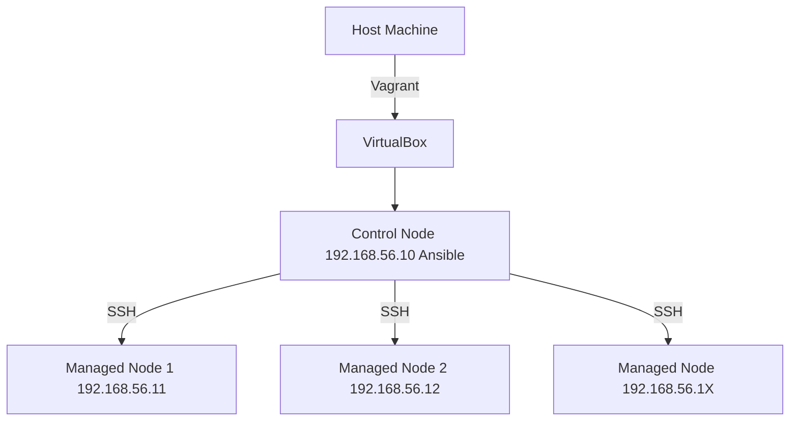

# **Vagrant Ansible Lab Setup Guide**

This guide will walk you through setting up a local Ansible control node and multiple managed nodes using Vagrant.

## **Vagrant Ansible Lab Architecture**




## **Prerequisites**

Before you begin, ensure you have the following installed on your host machine:

- Vagrant: Download and install from [https://www.vagrantup.com/downloads](https://www.vagrantup.com/downloads)
- VirtualBox (or another Vagrant provider): Download and install from [https://www.virtualbox.org/wiki/Downloads](https://www.virtualbox.org/wiki/Downloads)

##**Setup Steps**

Follow these steps to get your Ansible lab up and running:

### **Step 1: Create Project Directory and Vagrantfile**

Create a new directory for your project. You can name it `ansible_vagrant_lab` or anything you prefer.

```bash
mkdir ansible_vagrant_lab
cd ansible_vagrant_lab
```

Inside this new directory, create a file named Vagrantfile.

```bash
touch Vagrantfile
```

Open the Vagrantfile with your preferred text editor and paste the following content into it:

```ruby

# -*- mode: ruby -*-
# vi: set ft=ruby :

Vagrant.configure("2") do |config|

  VAGRANT_NUM_MANAGED_NODES = 2
  VAGRANT_IP_PREFIX = "192.168.56."

  config.vm.box = "ubuntu/focal64"
  config.vm.box_check_update = false

  # Generate SSH key on host if not exists
  unless File.exist?("ansible_id_rsa")
    system("ssh-keygen -t rsa -b 2048 -f ansible_id_rsa -N ''")
  end

  def host_entries
    entries = ["192.168.56.10 ansible-control"]
    (1..VAGRANT_NUM_MANAGED_NODES).each do |i|
      entries << "192.168.56.#{10 + i} ansible-managed-#{i}"
    end
    entries.join("\n")
  end

  # Shared synced folder to copy keys
  config.vm.synced_folder ".", "/vagrant", type: "virtualbox"

  # --- Control Node ---
  config.vm.define "ansible-control" do |control|
    control.vm.hostname = "ansible-control"
    control.vm.network "private_network", ip: "#{VAGRANT_IP_PREFIX}10"

    control.vm.provider "virtualbox" do |vb|
      vb.name = "ansible-control"
      vb.memory = "1024"
      vb.cpus = "1"
    end

    control.vm.provision "shell", inline: <<-SHELL
      sudo apt-get update
      sudo apt-get install -y ansible python3-pip

      # Create ansible user and give sudo
      sudo useradd -m -s /bin/bash ansible
      echo "ansible:ansible" | sudo chpasswd
      echo "ansible ALL=(ALL) NOPASSWD: ALL" | sudo tee /etc/sudoers.d/ansible

      # Install private key
      sudo mkdir -p /home/ansible/.ssh
      sudo cp /vagrant/ansible_id_rsa /home/ansible/.ssh/id_rsa
      sudo cp /vagrant/ansible_id_rsa.pub /home/ansible/.ssh/id_rsa.pub
      sudo chown -R ansible:ansible /home/ansible/.ssh
      sudo chmod 600 /home/ansible/.ssh/id_rsa
      sudo chmod 644 /home/ansible/.ssh/id_rsa.pub

      # Write Ansible inventory
      echo "[managed]" | sudo tee /etc/ansible/hosts
      for i in $(seq 1 #{VAGRANT_NUM_MANAGED_NODES}); do
        ip=$((10 + i))
        echo "ansible-managed-${i} ansible_host=#{VAGRANT_IP_PREFIX}${ip} ansible_user=ansible ansible_ssh_private_key_file=/home/ansible/.ssh/id_rsa" | sudo tee -a /etc/ansible/hosts
      done

      echo "#{host_entries}" | sudo tee -a /etc/hosts
    SHELL
  end

  # --- Managed Nodes ---
  (1..VAGRANT_NUM_MANAGED_NODES).each do |i|
    config.vm.define "ansible-managed-#{i}" do |managed|
      managed.vm.hostname = "ansible-managed-#{i}"
      managed.vm.network "private_network", ip: "#{VAGRANT_IP_PREFIX}#{10 + i}"

      managed.vm.provider "virtualbox" do |vb|
        vb.name = "ansible-managed-#{i}"
        vb.memory = "512"
        vb.cpus = "1"
      end

      managed.vm.provision "shell", inline: <<-SHELL
        sudo apt-get update
        sudo apt-get install -y python3 openssh-server

        # Create ansible user and install public key
        sudo useradd -m -s /bin/bash ansible
        echo "ansible:ansible" | sudo chpasswd
        echo "ansible ALL=(ALL) NOPASSWD: ALL" | sudo tee /etc/sudoers.d/ansible

        sudo mkdir -p /home/ansible/.ssh
        sudo cp /vagrant/ansible_id_rsa.pub /home/ansible/.ssh/authorized_keys
        sudo chown -R ansible:ansible /home/ansible/.ssh
        sudo chmod 600 /home/ansible/.ssh/authorized_keys

        echo "#{host_entries}" | sudo tee -a /etc/hosts
      SHELL
    end
  end
end


```
## **Step 2: Customize Vagrantfile (Optional)**

You can modify the following variables in your Vagrantfile to suit your needs:
```bash

VAGRANT_NUM_MANAGED_NODES: Change the value 2 to your desired number of Ansible managed nodes.
VAGRANT_IP_PREFIX: If you prefer a different private IP address range for your VMs, change "192.168.56." to your desired prefix.

```

## **Step 3: Start the Virtual Machines**

Navigate to your ansible_vagrant_lab directory in your terminal and run the following command:

```bash
vagrant up
```

This command will:

Download the ubuntu/focal64 Vagrant box (if you don't have it locally).
Create and configure the ansible-control VM.
Create and configure the specified number of ansible-managed-X VMs.
This process may take some time depending on your internet connection and system resources.

## **Step 4: Connect to the Ansible Control Node**

Once vagrant up completes, you can SSH into your Ansible control node:

```bash
vagrant ssh ansible-control
```

## **Step 5: Verify Ansible Setup on Control Node**

After connecting to the ansible-control VM, you can verify that Ansible is installed and the inventory file has been generated correctly:

```bash
ansible --version
cat /etc/ansible/hosts
```

You should see output similar to this, listing your managed nodes with their assigned IP addresses:
```text
[managed]
ansible-managed-1 ansible_host=192.168.56.11 ansible_user=vagrant ansible_ssh_private_key_file=/home/vagrant/.ssh/id_rsa
ansible-managed-2 ansible_host=192.168.56.12 ansible_user=vagrant ansible_ssh_private_key_file=/home/vagrant/.ssh/id_rsa
```

## **Step 6: 🧪 Test Ansible Ping****

```bash 
# Swtich user vagrant to ansible user
su - ansible 
# Password : ansible
```

## **Step 7: 🧪 Test Ansible Ping**

```bash
sudo -u ansible ansible all -m ping
```

## **Step 8: Clean Up (Optional)**
When you are finished with your lab and want to remove the virtual machines from your system, run the following command from your host machine (in the ansible_vagrant_lab directory):

```bash
vagrant destroy -f
```
This will power down and delete all the VMs created by the Vagrantfile.